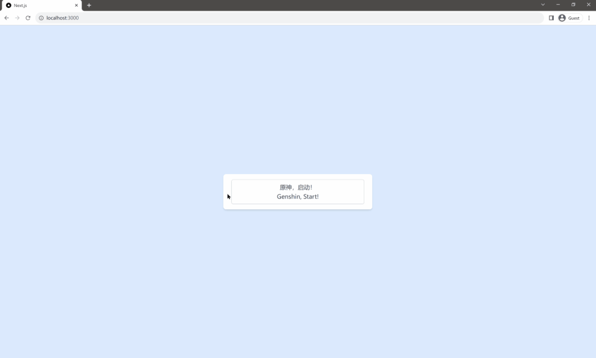

# Start Genshin Impact with React server action

> 原神，启动！



## Steps:

- corepack enable
- pnpm install
- pnpm dev
- click the `原神，启动！` button on the browser

## Code snippets

```tsx
import { GenshinImpactManager } from "@/lib/genshin-impact";

<form
  action={async () => {
    'use server'
    const genshin = new GenshinImpactManager();
    await genshin.start();
  }}
>
  <Button>
    Genshin, Start!
  </Button>
</form>
```
